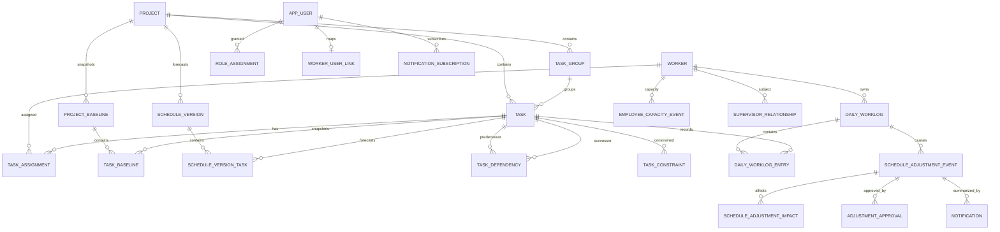
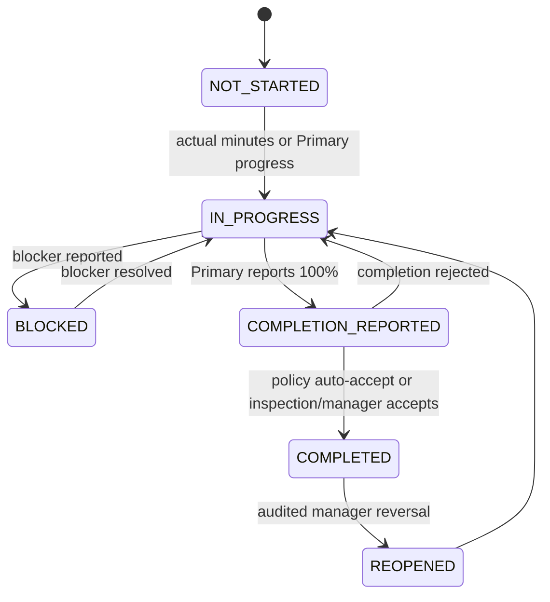
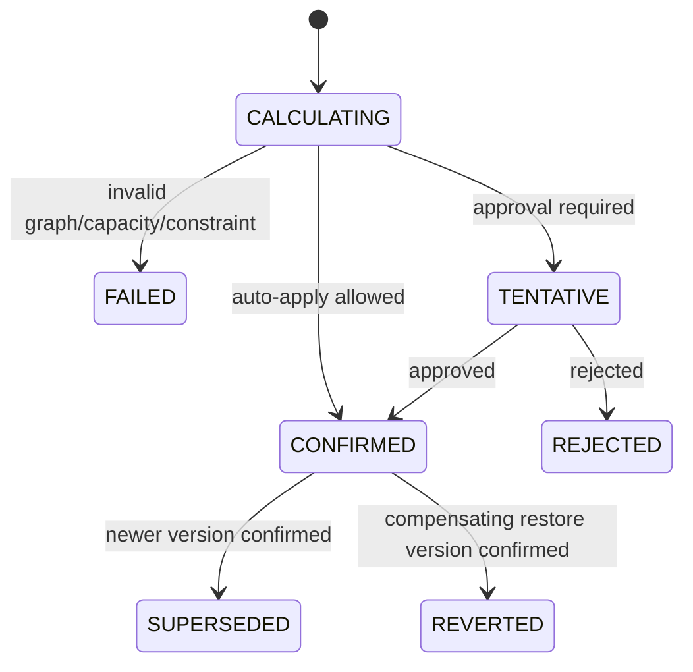

# Developer Scheduler V3 — Domain Model

## 0. Checkpoint 0.5/1 resolved policy overlay

This overlay is authoritative where older proposal language differs.

- Calendar time advances **planned** progress only. It never creates Actual progress, completion, or `completed_at`.
- Existing explicit completion/100% facts are preserved. Past incomplete Tasks retain their stored actual and become overdue/delayed.
- Current access is `TEST_SELECTOR`, not real authentication. `ActorContext` separates `test_actor` and `selected_view_context` and carries `actorMode`, `actorUserId`, `actorEmployeeId`, `selectedViewEmployeeId`, and `testSessionId`.
- Every write/audit fact carries `actor_mode`, `actor_user_id`, `subject_employee_id`, and `test_session_id` where applicable.
- CEO/COO are view/export-only and receive no mutation authority from the selector.
- Office policy: VN `Asia/Ho_Chi_Minh`, 08:00–17:00, 480 minutes; KR `Asia/Seoul`, 09:00–17:00, 420 minutes. Break 60 minutes is `PROVISIONAL_CONFIG`.
- Initial planned effort is `PROPOSED = baseline valid workdays × office daily task minutes`; only manager-confirmed values are `CONFIRMED`. Deferred workforce allocation weights are excluded.
- Forecast approval is `HYBRID_APPROVAL`; cross-project arbitration uses manager-defined project priority; Primary absence uses an effective-dated manager-assigned temporary Primary.
- Baseline V1 is immutable. Rebaseline requires one data-authorized manager relationship, never a hardcoded name.
- Employee retroactive self-edit cutoff is next working day 09:00 in employee local time; later changes require manager approval.
- Correction is append-only. Notification is in-app immediate plus daily manager digest, grouped as one worklog Adjustment Summary.
- `V3_CUTOVER_DATE` is configuration/migration input, initially `2026-08-11`.

Checkpoint 1 creates only `schedule_versions`, `schedule_version_tasks`, `task_actuals`, `task_completion_events`, `progress_snapshots`, and the small policy/migration audit support strictly required by those entities. Daily Worklog and dependency/approval/notification tables remain future work.

## 1. Domain principles

1. **Baseline is immutable.** It is the approved plan at a point in time and is never edited by worklogs.
2. **Forecast is versioned.** It is the currently predicted schedule derived from actual facts, remaining effort, capacity, dependencies, and constraints.
3. **Actual is factual and append-only.** Employee minutes, progress statements, deliverables, blockers, and explicit completion facts come from worklogs or audited manager actions.
4. **Time passage is not work.** Reaching an end date increases planned progress and can create overdue risk; it never creates actual progress or completion.
5. **Task progress has one authority.** Primary PIC or an audited manager/inspection event sets authoritative task progress. Support entries contribute minutes and evidence, not additive progress.
6. **Schedule changes are reproducible.** Every confirmed or tentative forecast version identifies its inputs, policy version, prior version, and adjustment event.
7. **View context is not identity.** The employee selected for viewing never changes the authenticated actor's permissions.

## 2. Core schedule concepts

### 2.1 Baseline Schedule

An immutable snapshot containing project dates and all scheduled task facts required to reproduce the approved plan:

- project and task dates;
- WBS group/order;
- planned effort and progress weight source;
- assignment snapshot;
- dependency and constraint snapshot;
- approval/source metadata;
- build and migration fingerprint.

`project_baselines` and `task_baselines` are the existing anchors. Version 1 for current projects is created once during migration. Convenience baseline columns on `projects` and `tasks` are projections of the selected approved baseline, not editable fields.

### 2.2 Forecast Schedule

A versioned set of project/task dates representing the best current estimate. A version is either:

- `TENTATIVE`: calculated and persisted for preview/approval, not the main Gantt schedule;
- `CONFIRMED`: approved or auto-applied and used by the main Gantt/API;
- `SUPERSEDED`: formerly confirmed but replaced;
- `REJECTED`: proposal rejected without changing the confirmed schedule;
- `REVERTED`: historical proposal whose effect was later undone by a new restoration version.

The existing `tasks.start_date/end_date` and `projects.start_date/end_date` remain a compatibility projection of the current confirmed forecast during migration. The canonical source becomes the selected `schedule_version` plus its task rows.

### 2.3 Actual Execution

Actual execution consists of immutable facts:

- employee and local work date;
- task/project and assignment;
- actual minutes and category;
- progress before/after statement;
- task remaining estimate;
- work result, deliverable, blocker, meeting evidence, attachment reference;
- explicit completion report and source;
- submitter, subject employee, timestamps, revision, and idempotency key.

Corrections create a new worklog revision and compensating adjustment; they do not silently replace historical facts.

## 3. Entity relationship model

Names in the diagram are conceptual. The migration plan maps them to existing and proposed D1 tables.

## 4. Entity responsibilities

### Existing entities to retain

| Entity | Responsibility in V3 |
|---|---|
| `projects` | Project identity/lifecycle and compatibility pointer to confirmed forecast |
| `task_groups` | WBS presentation grouping; not an implicit dependency |
| `tasks` | Stable task identity and compatibility projection |
| `task_assignees` | Current assignment membership/role; later add effective dates/history |
| `workers` | Employee profile, office, timezone, locale, base capacity |
| `country_holidays`, calendar override tables | Work-calendar eligibility inputs |
| `project_baselines`, `task_baselines` | Immutable approved baseline snapshots after strengthening |
| existing shift/completion/history logs | Legacy audit evidence, retained read-only |

### New canonical entities

| Entity | Key responsibility |
|---|---|
| `schedule_versions` | Project forecast header, sequence, status, parent/current pointers, engine policy |
| `schedule_version_tasks` | Per-task forecast dates, remaining effort, capacity/dependency explanation |
| `task_dependencies` | Reviewed predecessor/successor links and lag |
| `task_constraints` | Hard/soft start/end/milestone constraints |
| `daily_worklogs` | One employee/local-date workflow header with revisions |
| `daily_worklog_entries` | Multiple project/task/category entries for Morning and EOD facts |
| `employee_capacity_events` | Minute-level leave, company duty, meeting, training, or manual capacity changes |
| `task_actuals` | Current authoritative actual projection for fast reads; rebuildable from facts |
| `progress_snapshots` | Historical task/project KPI snapshots and weight provenance |
| `schedule_adjustment_events` | Correlated reason/source/approval/revert audit header |
| `schedule_adjustment_impacts` | Queryable before/after impact per task/project/employee |
| `adjustment_approvals` | Approval decisions and comments |
| identity/role/supervisor tables | Authenticated actor and organization-derived authorization |
| notification/subscription/outbox tables | Durable grouped notifications and retryable delivery |

## 5. Worklog aggregate and entry model

### 5.1 Worklog header

One logical worklog exists per `(employee_id, local_work_date)`. Multiple submissions are revisions of that worklog, not duplicate worklogs.

Required header facts:

- `employee_id`, `local_work_date`, `timezone_snapshot`;
- workflow status and revision;
- morning/EOD submission timestamps;
- `submitted_by_user_id`, `on_behalf_of_employee_id`;
- submission idempotency keys;
- current adjustment correlation ID;
- missing/late/retroactive flags.

### 5.2 Worklog entries

A header has multiple entries, allowing multiple projects and tasks. Uniqueness is `(worklog_id, task_id, entry_phase)` for task entries. Non-task categories use an entry ID and optional project.

Morning fields:

- project/task/assignment;
- planned minutes and target progress;
- expected deliverable, known blocker, outside-schedule flag, memo.

EOD fields:

- actual minutes;
- progress before/after;
- remaining estimated minutes;
- result, deliverable, blocker, completion report;
- work category and exception reason;
- meeting minutes/evidence and attachment reference.

## 6. Work category semantics

| Category | Task/project link | Capacity effect | Progress authority | Evidence rule |
|---|---|---:|---|---|
| `NORMAL_ASSIGNED_TASK` | task required | actual minutes consumed | Primary only | normal result |
| `UNPLANNED_SAME_PROJECT_TASK` | task or approved ad-hoc task | consumed | assigned Primary/manager | reason required |
| `OTHER_PROJECT_TASK` | actual other project/task required | consumed from employee day | actual task's Primary | reason recommended |
| `OUTSIDE_WORK_SAME_PROJECT` | project required, task optional | consumed; may count project contribution | no automatic task progress | meeting/business record required |
| `OUTSIDE_WORK_OTHER_PROJECT` | other project required | consumed | no automatic progress unless task linked | meeting/business record required |
| `COMPANY_DUTY` | project optional | removes schedulable capacity | none | duty description required |
| `TRAINING` | project optional | removes schedulable capacity | none | training record required |
| `MEETING` | project/task optional | removes task capacity; contribution tracked separately | no additive progress | minutes required if project-related |
| `APPROVED_LEAVE` | leave record required | capacity 0/partial | none | no meeting minutes |
| `EMERGENCY_LEAVE` | provisional leave link | capacity 0/partial | none | post-approval state |
| `NO_WORK_TECHNICAL_BLOCKER` | task recommended | capacity may remain available but task blocked | no inferred progress | blocker required |
| `NO_WORK_EXTERNAL_DEPENDENCY` | task required | capacity can be reallocated | no inferred progress | dependency/blocker required |

## 7. Task actual and completion state

### 7.1 Task actual state

- `NOT_STARTED`
- `IN_PROGRESS`
- `BLOCKED`
- `COMPLETION_REPORTED`
- `COMPLETED`
- `REOPENED`

`OVERDUE` and `DELAYED` are schedule-risk classifications, not lifecycle completion states.

### 7.2 Allowed completion sources

- `PRIMARY_WORKLOG_REPORT`
- `MANAGER_ON_BEHALF`
- `INSPECTION_ACCEPTED`
- `MIGRATED_EXISTING_COMPLETION`

Each completion records actual completion timestamp/date, actor, subject employee, source, worklog/inspection reference, and revision. Date passage is not an allowed source.

Recommended transition:

For V1, Primary completion may become `COMPLETED` immediately when inspection is not configured, but the completion event remains explicit and auditable.

## 8. Forecast and approval state

The main Gantt uses only `CONFIRMED`. A tentative version is shown in impact preview or a subtle comparison overlay; it never silently replaces the confirmed schedule.

## 9. Dependency and constraint domain

### Dependencies

- V1 required: `FINISH_TO_START`.
- Extensible: `START_TO_START`, `FINISH_TO_FINISH`.
- Lag is stored as work minutes; UI may display workdays using the successor's scheduling calendar.
- Relationship status: `PROPOSED`, `CONFIRMED`, `REJECTED`, `RETIRED`.
- Existing WBS/date adjacency may create `PROPOSED` candidates only.

### Constraints

- `AS_SOON_AS_POSSIBLE`
- `NOT_BEFORE`
- `FIXED_START`
- `FIXED_END`
- `MILESTONE`

Constraints have severity `HARD` or `SOFT`. Hard violations prevent auto-apply and require an explicit resolution; they are never silently moved.

## 10. Multi-assignee rules

1. Exactly one effective Primary is preferred for every schedulable task.
2. Primary progress is authoritative.
3. Support actual minutes and evidence are additive; support progress percentages are not.
4. Manager override creates a separate authoritative fact with reason.
5. Remaining effort belongs to the Task, not each employee.
6. Primary missing: task becomes `NEEDS_PRIMARY`; forecast may retain the last confirmed dates but cannot auto-apply progress-driven changes.
7. Primary on leave: capacity becomes zero; another worker becomes authoritative only through an effective-dated acting-Primary assignment.
8. Primary change: preserve task actuals and remaining effort; close the old assignment and open the new one. The new Primary acknowledges the remaining estimate.

## 11. Progress model

### Task actual progress

The latest accepted Primary/manager fact is authoritative. Actual minutes do not mechanically convert to a percentage unless no progress statement exists and a documented fallback is invoked.

Remaining effort precedence:

1. accepted `remaining_estimated_minutes`;
2. prior remaining effort minus accepted task-work minutes, bounded at zero;
3. `planned_effort_minutes × (1 - actual_progress)`;
4. migration-only duration/capacity estimate with `ESTIMATED` confidence;
5. unresolved (`NEEDS_ESTIMATE`)—never invent completion.

### Project actual progress weighting

Recommended weight precedence:

1. `planned_effort_minutes`;
2. approved explicit task weight;
3. planned working duration × approved assignment capacity;
4. equal-weight fallback with a visible low-confidence marker.

Current project allocation percentage is not authoritative while workforce weighting remains deferred.

## 12. Identity, permissions, and view context

### Roles

- `VIEWER_EXECUTIVE`: view/export all allowed projects; no worklog, approval, or schedule mutation.
- `TEAM_MANAGER`: team worklog oversight, delegated submission, approval, assignment, forecast governance.
- `PRIMARY_WORKER`: own worklogs and authoritative progress for assigned Primary tasks.
- `SUPPORT_WORKER`: own worklogs, actual minutes/evidence for support tasks.
- `SYSTEM_ADMIN`: identity/role/policy/migration administration; not implicit business approval.

### Actor separation

Every request carries:

- `authenticated_actor_user_id`: established by a trusted session/token;
- `selected_view_employee_id`: optional filter only;
- `subject_employee_id`: whose worklog/schedule is affected;
- `on_behalf_of_employee_id`: required for delegated submissions.

Authorization is computed from the authenticated actor and relationship tables. Changing the selected view employee never changes permission.

## 13. Domain invariants

1. Baseline rows are never updated or deleted by worklog operations.
2. One employee has one logical worklog per local work date.
3. A task appears at most once per worklog phase.
4. A worklog revision and action idempotency key can create at most one adjustment correlation.
5. Task progress is never the sum of assignee progress percentages.
6. Actual minutes are additive per employee/entry and never overwritten silently.
7. A confirmed forecast version is immutable.
8. Revert creates a new version reproducing a prior state; history is not deleted.
9. Only confirmed dependencies affect scheduling.
10. Hard constraints cannot be violated by auto-apply.
11. Missing worklogs do not imply zero actual work or automatic delay.
12. UTC timestamps and employee-local work dates are stored separately.
